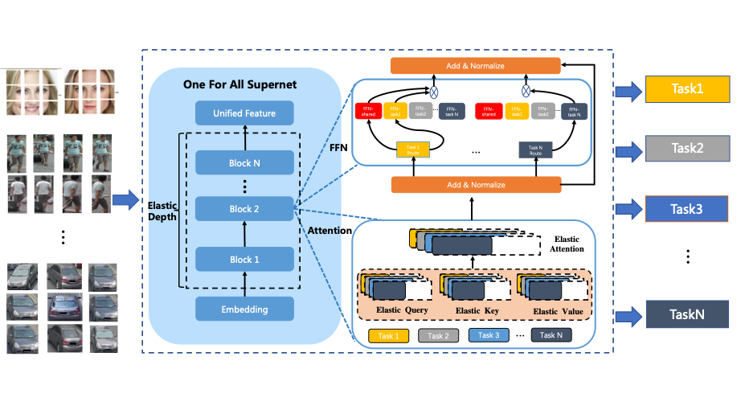

# UFO

- [ALL in one](#AllinOne)
  * [单模型覆盖智慧城市4大任务](#单模型覆盖智慧城市4大任务)
  * [任务设置与数据](#任务设置与数据)

百度提出统一特征表示优化技术（UFO：Unified Feature Optimization），在充分利用大数据和大模型的同时，兼顾大模型落地成本及部署效率。UFO技术方案的主要内容包括：
  * All in one：设计视觉表示多任务协同训练方案，免去了下游任务fine-tuning的过程，实现单模型在智慧城市多个核心任务效果全面领先
  * One for all：首创针对视觉多任务的超网络与训练方案，支持各类任务、各类硬件的灵活部署，解决大模型推理性能差的问题。

# 图1:UFO整体架构

## AllinOne：功能更强大、更通用的视觉模型
	之前主流的视觉模型生产流程，通常采用单任务 “train from scratch”方案。每个任务都从零开始训练，各个任务之间也无法相互借鉴。由于单任务数据不足带来偏置问题，实际效果过分依赖任务数据分布，场景泛化效果往往不佳。
近两年蓬勃发展的大数据预训练技术，通过使用大量数据学到更多的通用知识，然后迁移到下游任务当中，本质上是不同任务之间相互借鉴了各自学到的知识。基于海量数据获得的预训练模型具有较好的知识完备性，在下游任务中基于少量数据fine-tuning依然可以获得较好的效果。不过基于预训练+下游任务fine-tuning的模型生产流程，需要针对各个任务分别训练模型，存在较大的研发资源消耗。
	百度提出的UFO All in One模型，通过使用多个任务的数据训练一个功能强大的通用模型，可被直接应用于处理多个任务。不仅通过跨任务的信息提升了单个任务的效果，并且免去了下游任务fine-tuning过程。UFO All in One模型研发模式可被广泛应用于各类多任务AI系统，以智慧城市的多任务大模型为例，UFO All in One可以用单模型实现多个任务的SOTA识别效果，同时多任务模型可获得显著优于单任务模型的效果，证明了多任务之间信息借鉴机制的有效性。
### 单模型覆盖智慧城市4大任务
    智慧城市是目前计算机视觉技术最重要的应用场景之一，在智慧城市的各个任务中，往往要同时处理人脸、人体、车辆和通用物体等目标，这对AI系统的多任务协同能力提出了非常高的要求。现有的视觉模型大多只能检测或识别其中的一类目标，百度通过UFO方案中的多任务协同学习技术，产出城市视觉UFO模型同时处理这4类任务，并在10项公开数据集上效果取得SOTA。下面详细介绍UFO的多任务协同训练方案。

### 任务设置与数据
    为验证方案的有效性且便于公平对比，使用10项公开数据集进行训练和测试。各个数据集的统计信息如表所示：

