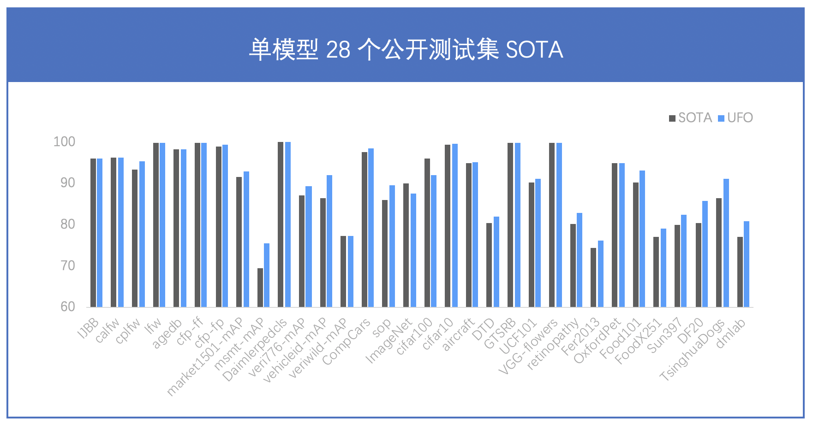

# VIMER-UFO 2.0 (文心-CV大模型)

- [整体概述](#整体概述)
- [原理介绍](#原理介绍)
  * [All In One:功能更强大更通用的视觉模型](#AllInOne:功能更强大更通用的视觉模型)
  * [One For All:灵活可伸缩的弹性部署方案](#OneForAll:灵活可伸缩的弹性部署方案)
  * [超网络设计与训练方案](#超网络设计与训练方案)
  * [One For All Tasks](#OneForAllTasks)
  * [One For All Chips](#OneForAllChips)
- [模型效果](#模型效果)
  * [170亿参数，行业最大CV大模型，单模型28项公开数据集SOTA](#170亿参数，行业最大CV大模型，单模型28项公开数据集SOTA)
- [应用场景与方案](#应用场景与方案)
  * [多任务大模型直接部署](#多任务大模型直接部署)
  * [单任务抽取子网络部署](#单任务抽取子网络部署)
  * [新任务快速扩展](#新任务快速扩展)
  * [子网络下游蒸馏](#子网络下游蒸馏)
- [使用方案](#使用方案)

## 整体概述

近年来预训练大模型一次次刷新记录，展现出惊人的效果，但对于产业界而言，势必要面对如何应用落地的问题。当前预训练模型的落地流程可被归纳为：针对只有少量标注数据的特定任务，使用任务数据 fine-tune 预训练模型并部署上线。然而，当预训练模型参数量不断增大后，该流程面临两个严峻的挑战。首先，随着模型参数量的急剧增加，大模型 fine-tuning 所需要的计算资源将变得非常巨大，普通开发者通常无法负担。其次，随着 AIoT 的发展，越来越多 AI 应用从云端往边缘设备、端设备迁移，而大模型却无法直接部署在这些存储和算力都极其有限的硬件上。

针对预训练大模型落地所面临的问题，百度提出统一特征表示优化技术（UFO：Unified Feature Optimization），在充分利用大数据和大模型的同时，兼顾大模型落地成本及部署效率。VIMER-UFO 2.0 技术方案的主要内容包括：
  * All in One：行业最大 170 亿参数视觉多任务模型，覆盖人脸、人体、车辆、商品、食物细粒度分类等 20+ CV 基础任务，单模型 28 个公开测试集效果 SOTA。
  * One for All：首创针对视觉多任务的超网络与训练方案，支持各类任务、各类硬件的灵活部署，解决大模型参数量大，推理性能差的问题。

## 原理介绍

### AllInOne:功能更强大更通用的视觉模型

之前主流的视觉模型生产流程，通常采用单任务  “train from scratch” 方案。每个任务都从零开始训练，各个任务之间也无法相互借鉴。由于单任务数据不足带来偏置问题，实际效果过分依赖任务数据分布，场景泛化效果往往不佳。近两年蓬勃发展的大数据预训练技术，通过使用大量数据学到更多的通用知识，然后迁移到下游任务当中，本质上是不同任务之间相互借鉴了各自学到的知识。基于海量数据获得的预训练模型具有较好的知识完备性，在下游任务中基于少量数据 fine-tuning 依然可以获得较好的效果。不过基于预训练+下游任务 fine-tuning 的模型生产流程，需要针对各个任务分别训练模型，存在较大的研发资源消耗。

百度提出的 VIMER-UFO All in One 多任务训练方案，通过使用多个任务的数据训练一个功能强大的通用模型，可被直接应用于处理多个任务。不仅通过跨任务的信息提升了单个任务的效果，并且免去了下游任务 fine-tuning 过程。VIMER-UFO All in One 研发模式可被广泛应用于各类多任务 AI 系统，以智慧城市场景为例，VIMER-UFO 可以用单模型实现人脸识别、人体和车辆ReID等多个任务的 SOTA 效果，同时多任务模型可获得显著优于单任务模型的效果，证明了多任务之间信息借鉴机制的有效性。

针对大模型的开发和部署问题，UFO给出了One for All的解决方案，通过引入超网络的概念，超网络由众多稀疏的子网络构成，每个子网络是超网络中的一条路径，将不同参数量、不同任务功能和不同精度的模型训练过程变为训练一个超网络模型。训练完成的One for All UFO超网络大模型即可针对不同的任务和设备低成本生成相应的可即插即用的小模型，实现One for All Tasks 和 One for All Chips的能力

### OneForAll:灵活可伸缩的弹性部署方案

受算力和存储的限制，大模型无法直接部署在边缘设备上。一个针对云端设备开发的模型要部署到边缘设备或端设备时往往要进行模型压缩，或完全重新设计，而预训练大模型的压缩本身需要耗费大量的资源。

另外，不同任务对模型的功能和性能要求也不同，例如人脸识别门禁系统只需具备人脸识别功能即可，智慧社区的管控系统则需要同时具备人脸识别和人体分析的能力，部分场景还需要同时具备车型识别及车牌识别能力。即便是同样的人脸识别任务，门禁系统和金融支付系统对模型的精度和性能要求也不同。目前针对这些任务往往需要定制化开发多个单任务模型，加之需要适配不同的硬件平台，AI模型开发的工作量显著增长。

针对大模型的开发和部署问题，VIMER-UFO 给出了 One for All 的解决方案，通过引入超网络的概念，超网络由众多稀疏的子网络构成，每个子网络是超网络中的一条路径，将不同参数量、不同任务功能和不同精度的模型训练过程变为训练一个超网络模型。训练完成的 VIMER-UFO One for All 超网络大模型即可针对不同的任务和设备低成本生成相应的可即插即用的小模型，实现 One for All Tasks 和 One for All Chips 的能力。

### 超网络设计与训练方案

VIMER-UFO 2.0 基于 Vision Transformer 结构设计了多任务多路径超网络。与谷歌 Switch Transformer 以图片为粒度选择路径不同，VIMER-UFO 2.0 以任务为粒度进行路径选择，这样当超网络训练好以后，可以根据不同任务独立抽取对应的子网络进行部署，而不用部署整个大模型。VIMER-UFO 2.0 的超网中不同的路径除了可以选择不同 FFN 单元，Attention 模块和 FFN 模块内部也支持弹性伸缩，实现网络的搜索空间扩展，为硬件部署提供更多可选的子网络，并提升精度。

VIMER-UFO 2.0 超网络分为多路径 FFN 超网和与可伸缩 Attention 超网两部分。首先针对多路径 FFN 超网模块，每个任务都有两种不同的路径选择，即选择共享 FFN（FFN-shared）或者专属 FFN（FFN-taskX），当选定好 FFN 以后，还可根据放缩系数弹性选择FFN中参数规模；因此FFN超网络中共有（T * ratio）^L 种不同的 FFN 路径，其中 T 为 task 的数量，L 为网络的层数, ratio 为放缩系数的数量。而对于 self-attention 超网，每个子网络可以选择不同的 Head 数量 QKV 矩阵参数量。

VIMER-UFO 2.0 训练时将模型按层级结构划分为任务超网和芯片超网两个级别。并分别使用不同的训练方案进行优化。

### OneForAllTasks

任务超网络训练时，需要同时优化网络参数（FFN）和路由参数（Router）。前面提到，网络参数包含共享 FFN（FFN-shared）和专属 FFN（FFN-taskX），所有任务都会更新共享 FFN 的参数，特定任务只会更新专属的 FFN 参数。而路由参数由于离散不可导，训练时通过 Gumbel Softmax 进行优化。由于在训练超网的过程中多个任务的同时进行优化，同时引入了路由机制，可以让相关的任务共享更多的参数，而不相关的任务之间尽量减少干扰，从而获得针对不同任务最优的子网络模型。在业务应用时，只需要根据不同子网络在特定任务的效果，抽取出对应的任务子网，即可直接部署，无需重复训练。

### OneForAllChips

在任务超网训练完成以后，针对每个任务抽取的子网络进行芯片子网络的训练。经过上述训练以后便得到了每个任务的芯片超网。在业务应用时，针对不同平台存储容量和算力不同，可以抽取不同深度和宽度的子网络进行部署，进一步压缩模型的参数和计算量。由于超网络中子网络的数据众多，每个子网逐一测试精度和延时并不现实，因此在 VIMER-UFO  2.0 中，使用了 GP-NAS中的基于高斯过程的超参数超参估计技术，只需采样超网络中少了子网络进行评估，即可准确预测出其他网络的精度和速度。

## 模型效果

### 170亿参数，行业最大CV大模型，单模型28项公开数据集SOTA

VIMER-UFO 2.0 单个模型一套参数，在不进行下游finetuning的情况下，在 28 个主流的 CV 公开数据集上取得了 SOTA 的结果。同时，尽管 VIMER-UFO 2.0 大模型参数量达到了170 亿，得益于 Task-MoE 稀疏结构，每个任务推理时只需激活部分参数，计算量相当于 6 亿参数模型规模，加速比接近 30 倍。

## 应用场景与方案

VIMER-UFO 2.0 大模型可被广泛应用于智慧城市、无人驾驶、工业生产等各类多任务 AI 系统。同时 VIMER-UFO 2.0 支持多种应用模式配合，兼顾效率和效果。

### 多任务大模型直接部署

针对有多任务处理需求的 AI 系统，VIMER-UFO 2.0 大模型具备处理多个任务的能力，例如同时进行人脸、人体和车辆等目标的检测和识别。同时得益于 VIMER-UFO 2.0大模型使用的Task-MoE稀疏结构，其在运行时，根据任务的不同自动选择激活最优的区域，每个任务只激活模型的部分参数，计算量显著降低，推理效率接近主流的单任务小模型。这类似于人脸的大脑，人类的大脑经过数百万年的进化，形成了分区的结构，不同区域负责特定功能，同时又是相互协作的一个整体。

### 单任务抽取子网络部署

针对只需要单个或个别处理能力的AI服务，可根据任务需求直接从 VIMER-UFO 2.0 大模型中抽取部分参数，得到针对特定任务的模型进行部署，可大幅减少模型的参数量，例如 VIMER-UFO 2.0 大模型具备 170 亿参数规模，而抽取的单任务模型只包含 6 亿参数，基于单任务模型抽取的芯片级模型参数量可进一步降低到 1 亿规模，压缩比达到 100+ 倍。并且不同任务之间可自由组合，大大提升了 AI 服务的开发和部署效率。
新任务快速扩展

### 新任务快速扩展

针对 VIMER-UFO 2.0 模型不支持的新任务，VIMER-UFO 2.0 支持在只更新部分参数的情况下，仅使用少量数据 finetune，实现任务的快速扩展。根据前面原理部分可知，VIMER-UFO 2.0 的超网络中有一个 share 的分支（Attention 与 FFN-Shared），该分支在 VIMER-UFO 2.0 大模型的训练过程中使用全部任务数据进行优化，因此具备了强大的任务泛化性，对于不支持的新任务，只需要抽取该分支的参数使用少量数据进行 fine-tuning，便可在新任务上达到优异的性能。同时由于只需要更新部分参数，下游 finetune 的成本大大降低，解决了目前主流大模型落地应用的难题。

新任务扩展结果：

|    Datasets          |         SOTA           |        10% Finetune |    100% Finetune    |
|:---------------------|:----------------------:|:-------------------:|:-------------------:|
|      dmlab           |          77            |         74.8        |        80.93        |
|      retinopathy     |          80.1          |         60.9        |        82.90        |
|      aircraft        |          94.90         |         70.84       |        95.02        |
|      cifar10         |          99.40         |         99.32       |        99.40        |
|      gtsrb           |          99.7          |         99.83       |        99.90        |

### 子网络下游蒸馏

为了更好的支持在移动和边缘设备上进行部署，VIMER-UFO 2.0 还支持抽取子网络模型进行模型蒸馏，结合百度研发的异构蒸馏技术，将 Transformer 结构中的知识迁移到 CNN 中，模型参数量从亿级别进一步压缩到兆级别的规模，整体实现 1000+ 倍的压缩。

## 使用方案

1. VIMER-UFO 2.0 相关的模型、训练代码和评测脚本均已开源，了解详细信息可访问：https://github.com/PaddlePaddle/VIMER/tree/main/UFO/OneForAll
2. VIMER-UFO 2.0 大模型近期也将开放在百度零门槛 AI 开发平台 EasyDL 中，敬请期待。

如遇到问题请联系xiteng01@baidu.com
